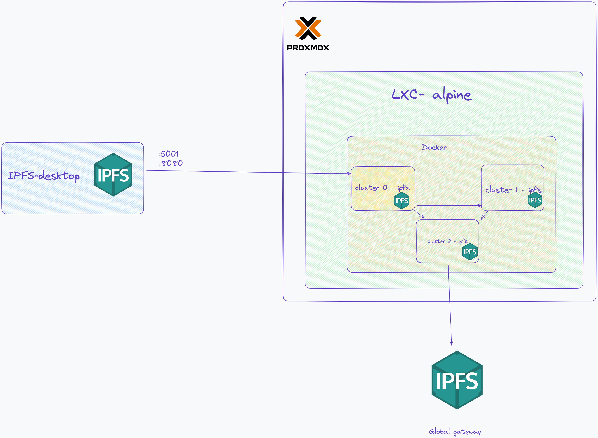

# Ansible-ipfs-study


This repository has the sole purpose of configuring the ipfs referenced in this [guide](https://docs.ipfs.tech/install/server-infrastructure/#create-a-local-cluster), inside an alpine container on a proxmox server.
In order to provide me with a bit of learning, it is possible to have an ipfs cluster running remotely, being accessed by an external host.


### Drawing of where the alpine is



This architecture runs inside an alpine lxc, where its export ports are 8080 and 5001, they are exposed because they will be used by the ipfs desktop on a client machine.

The ipfs clusters were used from the local cluster guide, for this a docker container would be needed.

I was thinking of using alpine, due to its size and security.

Ansible is used to orchestrate the installation and necessary configurations, without the need for a previously installed agent.

### How run

```shell 
ansible-playbook -i inventory ./ipfs.yml 
```


### References
- [create-a-local-cluster](https://docs.ipfs.tech/install/server-infrastructure/#create-a-local-cluster)
- [ipfs-desktop](https://docs.ipfs.tech/install/ipfs-desktop/#windows)
- [ipfscluster](https://ipfscluster.io/documentation/deployment/bootstrap/)